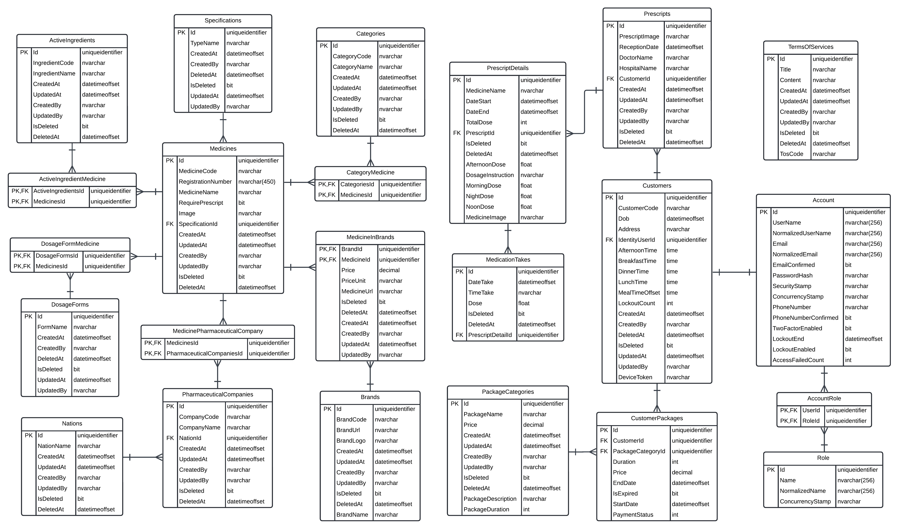

# PillPal - Backend WebAPI

<a name="top">

<div align="center">
  
</div>

<div align="left">
  <a href="./LICENSE"></a>
</div>

<div align="left">
  <a href="https://sonarcloud.io/summary/new_code?id=Pill-Pal-Group_pillpal-be"></a>
  <a href="https://sonarcloud.io/summary/new_code?id=Pill-Pal-Group_pillpal-be"></a>
  <a href="https://sonarcloud.io/summary/new_code?id=Pill-Pal-Group_pillpal-be"></a>
</div>

<div align="left">
  <a href="https://sonarcloud.io/summary/new_code?id=Pill-Pal-Group_pillpal-be"></a>
  <a href="https://sonarcloud.io/summary/new_code?id=Pill-Pal-Group_pillpal-be"></a>
  <a href="https://sonarcloud.io/summary/new_code?id=Pill-Pal-Group_pillpal-be"></a>
  <a href="https://sonarcloud.io/summary/new_code?id=Pill-Pal-Group_pillpal-be"></a>
</div>

<div align="left">
  
  
  <a href="https://sonarcloud.io/summary/new_code?id=Pill-Pal-Group_pillpal-be"></a>
</div>

<br/>

<div align="left">
  <a href="https://dotnet.microsoft.com"></a>
  <a href="https://www.nuget.org/"></a>
  <a href="https://www.microsoft.com/sql-server"></a>
  <a href="https://redis.io/"></a>
  <a href="https://hangfire.io/"></a>
  <a href="https://www.zalopay.vn/"></a>
  <a href="https://www.docker.com/"></a>
  <a href="https://www.nginx.com/"></a>
  <a href="https://render.com/"></a>
  <a href="https://cloud.google.com/"></a>
  <a href="https://firebase.google.com/"></a>
  <a href="https://sonarcloud.io/"></a>
  <a href="https://swagger.io/"></a>
  <a href="https://www.openapis.org/"></a>
  <a href="https://jwt.io/"></a>
</div>

<details>
  <summary>Click to expand</summary>

- [Introduction](#introduction)
- [System Overview](#system-overview)
- [Installation](#installation)
- [Contributors](#contributors)

</details>

## Introduction

Backend API for PillPal project. Built with the latest .NET 8.0 with Entity Framework Core. The source code is structured following the Clean Architecture with the Repository Pattern and was meticulously well-documented with Swagger and OpenAPI.

<p align="right"><a href="#top">[back to top]</a></p>

## System Overview

<div align="center">
  
  <p>Backend Architecture Design</p>
</div>
</br>
<div align="center">
  
  <p>Backend Package Design</p>
</div>
</br>
<div align="center">
  
  <p>Logical Database Design</p>
</div>

<p align="right"><a href="#top">[back to top]</a></p>

## Installation

Make sure you have the **.NET 8.0 SDK** installed on your machine. If not, you can download it [here](https://dotnet.microsoft.com/download/dotnet/8.0).

1. Clone the repository

```bash
git clone https://github.com/Pill-Pal-Group/pillpal-be.git
```

2. Navigate to the project directory

```bash
cd pillpal-be/src
```

3. Set the environment variables in the `appsettings.json` file

Configure environment variables in the `appsettings.json` file following the template provided in `appsettings.json.example`.
Both file are located in the `src/PillPal.WebApi` directory and should look like below:

```json
{
  "Logging": {
    "LogLevel": {
      "Default": "Information",
      "Microsoft.AspNetCore": "Warning"
    }
  },
  "AllowedHosts": "*",
  "FirebaseSettings": {
    "ProjectId": "ProjectId",
    "ServiceKey": "ServiceKey"
  },
  "JwtSettings": {
    "SecretKey": "SecretKey",
    "Issuer": "Issuer",
    "Audience": "Audience",
    "Expires": 60,
    "RefreshExpires": 43200
  },
  "CacheSettings": {
    "SlidingExpiration": 5,
    "AbsoluteExpiration": 60
  },
  "ConnectionStrings": {
    "REDIS": "REDIS_CONNECTION_STRING",
    "PILLPAL_DB": "PILLPAL_DB_CONNECTION_STRING",
    "HANGFIRE_DB": "HANGFIRE_DB_CONNECTION_STRING"
  },
  "Hangfire": {
    "User": "User",
    "Pass": "Pass"
  },
  "ZaloPay": {
    "AppId": "AppId",
    "AppUser": "AppUser",
    "Key1": "Key1",
    "Key2": "Key2",
    "PaymentUrl": "PaymentUrl",
    "ReturnUrl": "ReturnUrl",
    "IpnUrl": "IpnUrl"
  },
  "SwaggerServers": [ // Optional
    {
      "Url": "Server Url",
      "Description": "Server Description"
    }
  ]
}
```

> **Note**: SwaggerServers is an optional field. Provide if you already deployed to a server.

4. Migrate the database

```bash
dotnet ef database update --project PillPal.Infrastructure --startup-project PillPal.WebApi
```

5. Run the project

For straightforward execution, run the following command:

```bash
dotnet run --project PillPal.WebApi
```

Or for more flexible options while running the project, you can use the following command:

```bash
dotnet watch run --project PillPal.WebApi
```

<p align="right"><a href="#top">[back to top]</a></p>

## Contributors

<a href="https://github.com/Pill-Pal-Group/pillpal-be/graphs/contributors">
  
</a>

<p align="right"><a href="#top">[back to top]</a></p>
